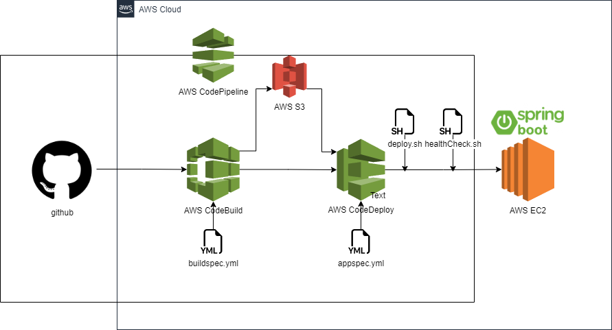

# Spring_SimpleAPI
AWS CI/CD 배포 실험용 리포

### API 명세
| Description | Method | URL     | Request Body           | Response Body |
|------------|--------|---------|------------------------|---------------|
| 테스트용       | GET         | /health |                 | String: "잘 실행되었습니다. UP" |
---
# CI/CD 구현

### 기술스택
- `project`
  - language : Java 11
  - JDK : Amazon corretto 11
  - Framework : SpringBoot 2.7.4
  - Dependency : Spring Web
- `source code` : Github
- `build tool` : AWS CodeBuild
- `Deploy tool` : AWS CodeDeploy

### workflow


---
# Gradle
### `build.gradle`
```gradle
archivesBaseName = 'springboot-deploy'
sourceCompatibility = '11'
```

# AWS CodeBuild
### `buildspec.yml`
```yaml
version: 0.2
phases:
  build:
    commands:
      - echo Build Starting on `date`
      - chmod +x ./gradlew
      - ./gradlew build
  post_build:
    commands:
      - echo $(basename ./build/libs/*.jar)
      - pwd
artifacts:
  files:
    - appspec.yml # code-deploy를 위해
    - build/libs/*.jar
    - scripts/**
  discard-paths: yes
cache:
  paths:
    - '/root/.gradle/caches/**/*'
```

---
# AWS CodeDeploy
### `appspec.yml`
```yaml
version: 0.0
os: linux

files:
  - source: /
    destination: /home/ec2-user/build # 인스턴스에서 파일이 저장될 위치

# ec2-user로 설정해야함
permissions:
  - object: /
    pattern: "**"
    owner: ec2-user
    group: ec2-user

hooks:
  ApplicationStart:
    - location: deploy.sh
      timeout: 60
      runas: ec2-user
  ValidateService:
    - location: healthCheck.sh
      timeout: 60
      runas: ec2-user
```

### `deploy.sh`
```shell
#!/bin/bash
BUILD_PATH=$(ls /home/ec2-user/build/*.jar)
JAR_NAME=$(basename $BUILD_PATH)
echo "> build 파일명: $JAR_NAME"

echo "> build 파일 복사"
DEPLOY_PATH=/home/ec2-user/
cp $BUILD_PATH $DEPLOY_PATH

echo "> springboot-deploy.jar 교체"
CP_JAR_PATH=$DEPLOY_PATH$JAR_NAME
APPLICATION_JAR_NAME=springboot-deploy.jar
APPLICATION_JAR=$DEPLOY_PATH$APPLICATION_JAR_NAME

ln -Tfs $CP_JAR_PATH $APPLICATION_JAR

echo "> 현재 실행중인 애플리케이션 pid 확인"
CURRENT_PID=$(pgrep -f $APPLICATION_JAR_NAME)

if [ -z $CURRENT_PID ]
then
  echo "> 현재 구동중인 애플리케이션이 없으므로 종료하지 않습니다."
else
  echo "> kill -15 $CURRENT_PID"
  kill -15 $CURRENT_PID
  sleep 5
fi

echo "> $APPLICATION_JAR 배포"
nohup java -jar $APPLICATION_JAR > /dev/null 2> /dev/null < /dev/null &
```

### `healthCheck.sh`
```shell
#!/bin/bash
echo "> Health check 시작"
echo "> curl -s http://localhost:8080/actuator/health "

for RETRY_COUNT in {1..15}
do
RESPONSE=$(curl -s http://localhost:8080/health)
UP_COUNT=$(echo $RESPONSE | grep 'UP' | wc -l)

if [ $UP_COUNT -ge 1 ]
then # $up_count >= 1 ("UP" 문자열이 있는지 검증)
echo "> Health check 성공"
break
else
echo "> Health check의 응답을 알 수 없거나 혹은 status가 UP이 아닙니다."
echo "> Health check: ${RESPONSE}"
fi

if [ $RETRY_COUNT -eq 10 ]
then
echo "> Health check 실패. "
exit 1
fi

echo "> Health check 연결 실패. 재시도..."
sleep 10
done
exit 0
```
---
