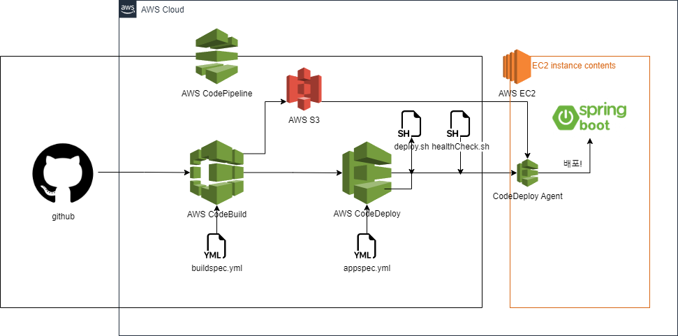
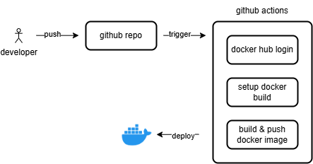

# Deploy test
CI/CD 배포 실험용 리포

### API 명세
| Description | Method | URL     | Request Body           | Response Body |
|------------|--------|---------|------------------------|---------------|
| 테스트용       | GET         | /health |                 | String: "잘 실행되었습니다. UP" |
---
### AWS CodeBuild / CodeDeploy

---
### Github Actions

